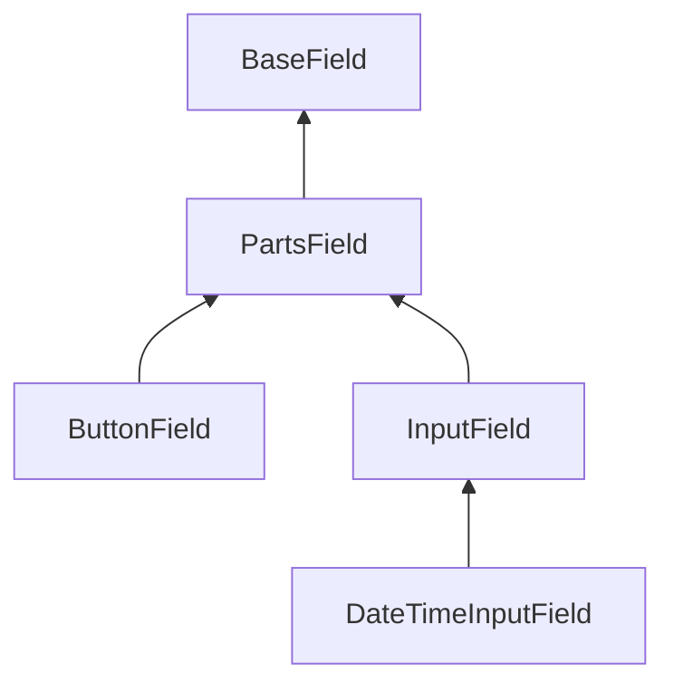

# Creating and Using Custom Fields

Using the fields included in the package, you may also create your own fields.

## Creating Field Class

Field class must extend `Yiisoft\Form\Field\Base\BaseField` or one of his heirs and implement necessary abstract 
methods. 

### Base Classes

- `BaseField` — base class that contain common functionality of fields.
- `PartsField` — class extends `BaseField`, add templating functionality and parts of field (label, hint, error).  
- `InputField` — class extends `PartsField`, add form model support (in most cases, this class is used).
- `ButtonField` — specific class for button fields, extends `PartsField`.
- `DateTimeInputField` — specific class for creating form controls with date and/or time input, extends `InputField`.

Base abstract classes structure:



### Feature Traits

You can use feature traits for your field class.

#### `FormAttributeTrait` 

Add methods for using form model.

#### `FieldContentTrait`

Add methods for set and generate custom content of fields.

#### `VaidationClassTrait` 

Add methods for set valid and invalid CSS classes. 

For applying common fields configuration when field creating through a field factory class must implement 
`ValidationClassInterface`.

#### `PlaceholderTrait`

Add methods for using placeholder. Available for heirs of `InputField` only. 

For applying common fields configuration when field creating through a field factory class must implement
`PlaceholderInterface`.

#### `EnrichmentFromRulesTrait`

Add method for set option of enrichment field from form model rules.

For applying common fields configuration when field creating through a field factory class must implement
`EnrichmentFromRulesInterface`.

## Field Configuration

Set base configuration of field in parameter "fieldConfigs" of field factory. For example:

```php
'fieldConfigs' => [
    MyCustomField::class => [
        'containerTag()' => ['div'],
        'containerAttributes()' => [['class' => 'main-wrapper']],
        'inputAttributes()' => [['data-type' => 'input-text']],
        'customMethod()' => [true],
    ],
],
```

Detailed information about configuration of fields see [here](fields-configuration.md).

## Example of Custom Field

Field class:

```php
use Yiisoft\Form\Field\Base\InputField;
use Yiisoft\Html\Html;

final class SuffixInput extends InputField
{
    private ?string $suffix = null;

    public function suffix(?string $suffix): self
    {
        $new = clone $this;
        $new->suffix = $suffix;
        return $new;
    }

    protected function generateInput(): string
    {
        $input = Html::textInput(
            $this->getInputName(),
            (string) $this->getFormAttributeValue(),
            $this->getInputAttributes()
        )->render();

        if ($this->suffix === null) {
            $html = $input;
        } else {
            $html = '<div class="input-group">' . "\n";
            $html .= $input . "\n";
            $html .= '<span class="input-group-text">' . Html::encode($this->suffix) . '</span>' . "\n";
            $html .= '</div>';
        }

        return $html;
    }
}
```

Field using:

```php
echo \Yiisoft\Form\Field::input(SuffixInput::class, $procentForm, 'value')->suffix('%');
```

Result will be:

```html
<div>
    <label for="procentform-value">Value</label>
    <div class="input-group">
        <input type="text" id="procentform-value" name="ProcentForm[value]" value>
        <span class="input-group-text">%</span>
    </div>
</div>
```
