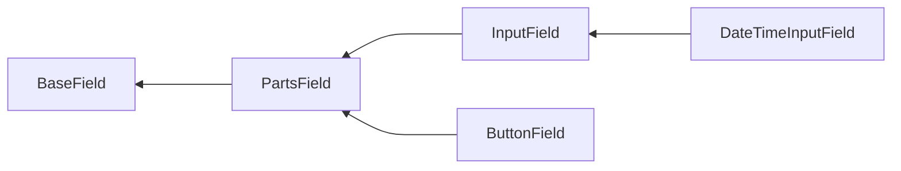

# Field methods

Depending on which class the field is based on and which interfaces it implements, the different methods are available.

Package provides base classes, with following hierarchy:



And interfaces:

- `PlaceholderInterface`
- `EnrichFromValidationRulesInterface`
- `ValidationClassInterface`

## `BaseField` based fields

All fields are inherited from `BaseField` class that define outer container. For example, directly from `BaseField ` inherited `ErrorSummary`.

### `containerTag()`

Define HTML tag for outer container that wraps the field (by default, `div`).

```php
echo Yiisoft\Form\Field\Text::widget()->containerTag('span');
```
```html
<span>
    <input type="text">
</span>
```

### `containerAttributes()` / `addContainerAttributes()`

Define HTML attributes for outer container that wraps the field.

```php
echo Yiisoft\Form\Field\Text::widget()->containerAttributes([
    'class' => 'field-container',
    'data-key' => 'value',
]);
```

```html
<div class="field-container" data-key="value">
    <input type="text">
</div>
```

To add attributes instead of replace use `addContainerAttributes()` method. Note that values within the same attribute will not be merged, newly added value overrides previous one.

```php
echo Yiisoft\Form\Field\Text::widget()
    ->containerAttributes([
        'class' => 'field-container',
        'data-key' => 'value',
    ])
    ->addContainerAttributes([
        'class' => 'focus',
        'data-type' => 'name',
    ]);       
```

```html
<div class="focus" data-key="value" data-type="name">
    <input type="text">
</div>
```

### `containerId()`

Define HTML ID for outer container that wraps the field.

```php
echo Yiisoft\Form\Field\Text::widget()->containerId('FieldContainer');
```

```html
<div id="FieldContainer">
    <input type="text">
</div>
```

### `containerClass()` / `addContainerClass()`

Define HTML classes for outer container that wraps the field.

```php
echo Yiisoft\Form\Field\Text::widget()->containerClass('field-container');
```

```html
<div class="field-container">
    <input type="text">
</div>

```

To add class instead of replace use `addContainerClass()` method.

```php
echo Yiisoft\Form\Field\Text::widget()
    ->containerClass('field-container')
    ->addContainerClass('focus', 'primary');
```

```html
<div class="field-container focus primary">
    <input type="text">
</div>
```

### `useContainer()`

Define whether to use outer container that wraps the field (by default, `true`).

```php
echo Yiisoft\Form\Field\Text::widget()->useContainer(false);
```

```html
<input type="text">
```

## `PartsField` based fields

...

## `InputField` based fields

...

## `ButtonField` based fields

...

## `DateTimeInputField` based fields

...

## `PlaceholderInterface` implemented fields

...

## `EnrichFromValidationRulesInterface` implemented fields

...

## `ValidationClassInterface` implemented fields

...

-----

- [Parts field](field-common-methods/parts-field/field.md)
  - [Visibility / content](field-common-methods/parts-field/field.md#visibility--content) 
  - [Config](field-common-methods/parts-field/field.md#config)
  - [Attributes](field-common-methods/parts-field/field.md#attributes)
  - [ID](field-common-methods/parts-field/field.md#id)
  - [Class](field-common-methods/parts-field/field.md#class)
  - [Input container](field-common-methods/parts-field/input-container.md)
    - [Tag](field-common-methods/parts-field/input-container.md#tag)
    - [Attributes](field-common-methods/parts-field/input-container.md#attributes)
    - [Class](field-common-methods/parts-field/input-container.md#class)
  - [Templating system](field-common-methods/parts-field/templating-system.md)
    - [Template](field-common-methods/parts-field/templating-system.md#template)
    - [Tokens](field-common-methods/parts-field/templating-system.md#tokens)
- [Input field](field-common-methods/input-field/field.md) 
  - [Attributes](field-common-methods/input-field/field.md#attributes)
  - [ID](field-common-methods/input-field/field.md#id)
  - [Class](field-common-methods/input-field/field.md#class)
  - [Form](field-common-methods/input-field/field.md#form)
