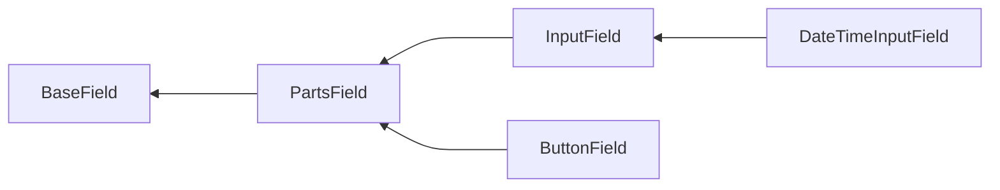

# Field methods

Depending on which class the field is based on and which interfaces it implements, the different methods are available.

Package provides base classes, with following hierarchy:



And interfaces:

- `PlaceholderInterface`;
- `EnrichFromValidationRulesInterface`;
- `ValidationClassInterface`.

## `BaseField` based fields

`BaseField` class defines field's outer container. `ErrorSummary` is an example of fields inherited directly from 
`BaseField `.

### `containerTag()`

HTML tag for outer container that wraps the field.

Usage:

```php
use Yiisoft\Form\Field\Text;

echo Text::widget()->containerTag('span');
```

Result:

```html
<span>
    <input type="text">
</span>
```

When not specified, `div` tag is used.

### `containerAttributes()` / `addContainerAttributes()`

HTML attributes for outer container that wraps the field.

Usage:

```php
use Yiisoft\Form\Field\Text;

echo Text::widget()->containerAttributes(['class' => 'field-container']);
```

Result:

```html
<div class="field-container">
    <input type="text">
</div>
```

No attributes are used by default.

To add attributes to the existing ones:

```php
use Yiisoft\Form\Field\Text;

$field = Text::widget()->containerAttributes(['class' => 'field-container']);
    
/** @var $condition bool */
if ($condition) {
    $field = $field->addContainerAttributes(['data-type' => 'name']);       
}

echo $field;
```

Result:

```html
<div class="field-container" data-type="name">
    <input type="text">
</div>
```

Note that values within the same attribute will not be merged, newly added value overrides previous one:

```php
use Yiisoft\Form\Field\Text;

$field = Text::widget()->containerAttributes(['class' => 'field-container']);
    
/** @var $condition bool */
if ($condition) {
    $field = $field->addContainerAttributes(['class' => 'focus']);       
}

echo $field;
```

Result:

```html
<div class="focus">
    <input type="text">
</div>
```

### `containerId()`

HTML ID for outer container that wraps the field.

Usage:

```php
use Yiisoft\Form\Field\Text;

echo Text::widget()->containerId('field-container');
```

```html
<div id="field-container">
    <input type="text">
</div>
```

No ID is used by default.

### `containerClass()` / `addContainerClass()`

HTML class for outer container that wraps the field.

Usage:

```php
use Yiisoft\Form\Field\Text;

echo Text::widget()->containerClass('field-container');
```

```html
<div class="field-container">
    <input type="text">
</div>
```

No class is used by default.

To add classes to existing ones:

```php
use Yiisoft\Form\Field\Text;

$field = Text::widget()->containerClass('field-container');

/** @var $condition bool */
if ($condition) {
    $field = $field->addContainerClass('focus');
}

echo $field;
```

Result:

```html
<div class="field-container focus">
    <input type="text">
</div>
```

For multiple classes, separate them with space:

```php
use Yiisoft\Form\Field\Text;

$field = Text::widget()->containerClass('field-container');

/** @var $condition bool */
if ($condition) {
    $field = $field->addContainerClass('focus info');
}

echo $field;
```

Result:

```html
<div class="field-container focus info">
    <input type="text">
</div>
```

### `useContainer()`

Whether to use outer container that wraps the field.

To disable container:

```php
use Yiisoft\Form\Field\Text;

echo Text::widget()->useContainer(false);
```

Result:

```html
<input type="text">
```

Enable container (default):

```php
use Yiisoft\Form\Field\Text;

echo Text::widget()->useContainer(true);
```

Result:

```html
<div>
    <input type="text">
</div>
```

## `PartsField` based fields

Parts field consists of 4 elements:

- Label;
- Hint;
- Input;
- Error.

Input here can be composite and can contain multiple elements.

### `label()`

By default, label is not shown. To show it, call self-titled methods:

```php
echo \Yiisoft\Form\Field\Text::widget()->label('Name');
```

```html
<div>
    <label>Name</label>
    <input type="text">
</div>
```

Another way is to use [config].

### `hint()`

By default, hint is not shown. To show it, call self-titled methods:

```php
echo \Yiisoft\Form\Field\Text::widget()->hint('Enter name');
```

```html
<div>
    <input type="text">
    <div>Enter name</div>
</div>
```

Another way is to use [config].

### `error()`

By default, error is not shown. To show it, call self-titled methods:

```php
echo \Yiisoft\Form\Field\Text::widget()->error('Name is not valid.');
```

```html
<div>
    <input type="text">
    <div>Name is not valid.</div>
</div>
```

Another way is to use [config].

### `hideLabel()`

For the label, there is additional method to control its visibility. It can be hidden:

```php
use Yiisoft\Form\Field\Text;

$field = Text::widget();

/** @var bool $condition */
if ($condition) {
    $field = $field->hideLabel();
}

$field = $field->label('Name')

echo $field;
```

> The order of method calls is not important.

To show it:

```php
use Yiisoft\Form\Field\Text;

$field = Text::widget();

/** @var bool $condition */
if ($condition) {
    $field = $field->hideLabel(false);
}

$field = $field->label('Name')

echo $field;
```

### `labelConfig()`

Config with [definitions](https://github.com/yiisoft/definitions) for label.

Usage:

```php
echo \Yiisoft\Form\Field\Text::widget()->labelConfig(['content()' => ['Name'], 'class()' => ['label']]);    
```

```html
<div>
    <label class="label">Name</label>
    <input type="text">
</div>
```

### `hintConfig()`

Config with [definitions](https://github.com/yiisoft/definitions) for hint.

Usage:

```php
echo \Yiisoft\Form\Field\Text::widget()->hintConfig(['content()' => ['Enter name'], 'class()' => ['hint']]);
```

```html
<div>
    <input type="text">
    <div class="hint">Enter name</div>
</div>
```

### `errorConfig()`

Config with [definitions](https://github.com/yiisoft/definitions) for error.

Usage:

```php
echo \Yiisoft\Form\Field\Text::widget()->errorConfig(['content()' => ['Enter name'], 'class()' => ['hint']]);
```

```html
<div>
    <input type="text">
    <div class="error">Enter name</div>
</div>
```

### `labelAttributes()` / `addLabelAttributes()` 

HTML attributes for label.

```php
echo \Yiisoft\Form\Field\Text::widget()
    ->label('Name')
    ->labelAttributes(['class' => 'label', 'data-type' => 'name']);
```

> The label must be visible (use [`label()`](#label) or [`labelConfig()](#labelconfig) methods).

```html
<div>
    <label class="label" data-type="name">Name</label>
    <input type="text">
</div>
```

To add attributes to the existing ones instead of replacing, use `addLabelAttributes()` method. Note that values within
the same attribute will not be merged, newly added value overrides previous one.

```php
echo \Yiisoft\Form\Field\Text::widget()
    ->label('Name')
    ->labelAttributes(['class' => 'label', 'data-type' => 'name'])
    ->addLabelAttributes(['class' => 'focus', 'data-sort' => 1]);
```

Result:

```html
<div>
    <label class="focus" data-type="label" data-sort="1">Name</label>
    <input type="text">
</div>
```

### `hintAttributes()` / `addHintAttributes()`

HTML attributes for hint.

```php
echo \Yiisoft\Form\Field\Text::widget()
    ->hint('Enter name')
    ->hintAttributes(['class' => 'hint', 'data-type' => 'name']);
```

> The hint must be visible (use [`hint()`](#hint) or [`hintConfig()](#hintconfig) methods).

```html
<div>
    <input type="text">
    <div class="hint" data-type="name">Enter name</div>
</div>
```

To add attributes to the existing ones instead of replacing, use `addHintAttributes()` method. Note that values within
the same attribute will not be merged, newly added value overrides previous one.

```php
echo \Yiisoft\Form\Field\Text::widget()
    ->hint('Enter name')
    ->hintAttributes(['class' => 'hint', 'data-type' => 'name'])
    ->addHintAttributes(['class' => 'focus', 'data-sort' => 1]);
```

Result:

```html
<div>
    <input type="text">
    <div class="hint" data-type="name" data-sort="1">Enter name</div>
</div>
```

### `errorAttributes()` / `addErrorAttributes()`

HTML attributes for error.

```php
echo \Yiisoft\Form\Field\Text::widget()
    ->error('Name is not valid.')
    ->errorAttributes(['class' => 'error', 'data-type' => 'name']);
```

> The error must be visible (use [`error()`](#error) or [`errorConfig()](#errorconfig) methods).

```html
<div>
    <input type="text">
    <div class="error" data-type="name">Name is not valid.</div>
</div>
```

To add attributes to the existing ones instead of replacing, use `addErrorAttributes()` method. Note that values within
the same attribute will not be merged, newly added value overrides previous one.

```php
echo \Yiisoft\Form\Field\Text::widget()
    ->errir('Enter name')
    ->errorAttributes(['class' => 'error', 'data-type' => 'name'])
    ->addErrorAttributes(['class' => 'focus', 'data-sort' => 1]);
```

Result:

```html
<div>
    <input type="text">
    <div class="error" data-type="name" data-sort="1">Enter name</div>
</div>
```

### `labelId()`

HTML ID for label.

```php
echo \Yiisoft\Form\Field\Text::widget()
    ->label('Name')
    ->labelId('label');
```

> The label must be visible (use [`label()`](#label) or [`labelConfig()](#labelconfig) methods).

```html
<div>
    <label id="label">Name</label>
    <input type="text">
</div>
```

### `hintId()`

HTML ID for hint.

```php
echo \Yiisoft\Form\Field\Text::widget()
    ->hint('Enter name')
    ->hintId('hint');
```

> The hint must be visible (use [`hint()`](#hint) or [hintlConfig()](#hintconfig) methods).

Result:

```html
<div>
    <input type="text">
    <div id="hint">Enter name</div>
</div>
```

```labelClass```

### `errorId()`

HTML ID for error.

```php
echo \Yiisoft\Form\Field\Text::widget()
    ->error('Name is not valid.')
    ->errorId('error');
```

> The error must be visible (use [`error()`](#error) or [errorlConfig()](#errorconfig) methods).

Result:

```html
<div>
    <input type="text">
    <div id="error">Name is not valid.</div>
</div>
```

### `labelClass()` / `addLabelClass()`

HTML class for label. In case of multiple classes, pass them as separate arguments.

```php
echo \Yiisoft\Form\Field\Text::widget()
    ->label('Name')
    ->labelClass('label', 'focus');
```

> The label must be visible (use [`label()`](#label) or [`labelConfig()](#labelconfig) methods).:

```html
<div>
    <label class="label focus">Name</label>
    <input type="text">
</div>
```

To add class to the existing ones instead of replacing, use `addLabelClass()` method. In case of multiple classes, pass
them as separate arguments.

```php
echo \Yiisoft\Form\Field\Text::widget()
    ->label('Name')
    ->labelClass('label')
    ->addLabelClass('focus primary');    
```

```html
<div>
    <label class="label focus primary">Name</label>
    <input type="text">
</div>
```

### `hintClass()` / `addHintClass()`

HTML class for hint. In case of multiple classes, pass them as separate arguments.

```php
echo \Yiisoft\Form\Field\Text::widget()
    ->hint('Enter name')
    ->hintClass('hint', 'focus');
```

> The hint must be visible (use [`hint()`](#hint) or [`hintConfig()](#hintconfig) methods).:

```html
<div>
    <div class="hint focus">Enter name</div>
    <input type="text">
</div>
```

To add class to the existing ones instead of replacing, use `addHintClass()` method. In case of multiple classes, pass
them as separate arguments.

```php
echo \Yiisoft\Form\Field\Text::widget()
    ->hint('Name')
    ->hintClass('hint')
    ->addHintClass('focus primary');    
```

```html
<div>
    <input type="text">
    <div class="hint focus primary">Enter name</div>
</div>
```

### `errorClass()` / `addErrorClass()`

HTML class for error. In case of multiple classes, pass them as separate arguments.

```php
echo \Yiisoft\Form\Field\Text::widget()
    ->error('Name is not valid.')
    ->errorClass('error', 'focus');
```

> The error must be visible (use [`error()`](#error) or [`errorConfig()](#errorconfig) methods).:

```html
<div>
    <div class="error focus">Name is not valid.</div>
    <input type="text">
</div>
```

To add class to the existing ones instead of replacing, use `addErrorClass()` method. In case of multiple classes, pass
them as separate arguments.

```php
echo \Yiisoft\Form\Field\Text::widget()
    ->error('Name')
    ->errorClass('error')
    ->addErrorClass('focus primary');    
```

```html
<div>
    <input type="text">
    <div class="error focus primary">Name is not valid</div>
</div>
```

## `InputField` based fields

...

## `ButtonField` based fields

...

## `DateTimeInputField` based fields

...

## `PlaceholderInterface` implemented fields

...

## `EnrichFromValidationRulesInterface` implemented fields

...

## `ValidationClassInterface` implemented fields
