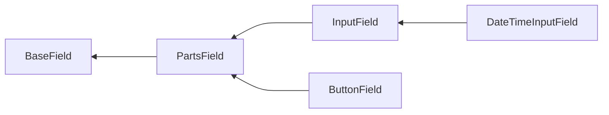

# Field methods

Depending on which class the field is based on and which interfaces it implements, the different methods are available.

Package provides base classes, with following hierarchy:



And interfaces:

- `PlaceholderInterface`;
- `EnrichFromValidationRulesInterface`;
- `ValidationClassInterface`.

## `BaseField` based fields

`BaseField` class defines field's outer container. `ErrorSummary` is an example of fields inherited directly from 
`BaseField `.

### `containerTag()`

HTML tag for outer container that wraps the field.

Usage:

```php
use Yiisoft\Form\Field\Text;

echo Text::widget()->containerTag('span');
```

Result:

```html
<span>
    <input type="text">
</span>
```

When not specified, `div` tag is used.

### `containerAttributes()` / `addContainerAttributes()`

HTML attributes for outer container that wraps the field.

Usage:

```php
use Yiisoft\Form\Field\Text;

echo Text::widget()->containerAttributes(['class' => 'field-container']);
```

Result:

```html
<div class="field-container">
    <input type="text">
</div>
```

No attributes are used by default.

To add attributes to the existing ones:

```php
use Yiisoft\Form\Field\Text;

$field = Text::widget()->containerAttributes(['class' => 'field-container']);
    
/** @var $condition bool */
if ($condition) {
    $field = $field->addContainerAttributes(['data-type' => 'name']);       
}

echo $field;
```

Result:

```html
<div class="field-container" data-type="name">
    <input type="text">
</div>
```

Note that values within the same attribute will not be merged, newly added value overrides previous one:

```php
use Yiisoft\Form\Field\Text;

$field = Text::widget()->containerAttributes(['class' => 'field-container']);
    
/** @var $condition bool */
if ($condition) {
    $field = $field->addContainerAttributes(['class' => 'focus']);       
}

echo $field;
```

Result:

```html
<div class="focus">
    <input type="text">
</div>
```

### `containerId()`

HTML ID for outer container that wraps the field.

Usage:

```php
use Yiisoft\Form\Field\Text;

echo Text::widget()->containerId('field-container');
```

```html
<div id="field-container">
    <input type="text">
</div>
```

No ID is used by default.

### `containerClass()` / `addContainerClass()`

HTML class for outer container that wraps the field.

Usage:

```php
use Yiisoft\Form\Field\Text;

echo Text::widget()->containerClass('field-container');
```

```html
<div class="field-container">
    <input type="text">
</div>
```

No class is used by default.

To add classes to existing ones:

```php
use Yiisoft\Form\Field\Text;

$field = Text::widget()->containerClass('field-container');

/** @var $condition bool */
if ($condition) {
    $field = $field->addContainerClass('focus');
}

echo $field;
```

Result:

```html
<div class="field-container focus">
    <input type="text">
</div>
```

For multiple classes, separate them with space:

```php
use Yiisoft\Form\Field\Text;

$field = Text::widget()->containerClass('field-container');

/** @var $condition bool */
if ($condition) {
    $field = $field->addContainerClass('focus info');
}

echo $field;
```

Result:

```html
<div class="field-container focus info">
    <input type="text">
</div>
```

### `useContainer()`

Whether to use outer container that wraps the field.

To disable container:

```php
use Yiisoft\Form\Field\Text;

echo Text::widget()->useContainer(false);
```

Result:

```html
<input type="text">
```

Enable container (default):

```php
use Yiisoft\Form\Field\Text;

echo Text::widget()->useContainer(true);
```

Result:

```html
<div>
    <input type="text">
</div>
```

## `PartsField` based fields

...

## `InputField` based fields

...

## `ButtonField` based fields

...

## `DateTimeInputField` based fields

...

## `PlaceholderInterface` implemented fields

...

## `EnrichFromValidationRulesInterface` implemented fields

...

## `ValidationClassInterface` implemented fields
