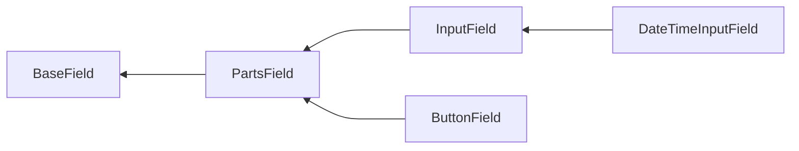

# Field methods

Depending on which class the field is based on and which interfaces it implements, the different methods are available.

Package provides base classes, with following hierarchy:



And interfaces:

- `PlaceholderInterface`;
- `EnrichFromValidationRulesInterface`;
- `ValidationClassInterface`.

## `BaseField` based fields

`BaseField` class defines field's outer container. `ErrorSummary` is an example of fields inherited directly from 
`BaseField `.

### `containerTag()`

HTML tag for outer container that wraps the field.

```php
echo \Yiisoft\Form\Field\Text::widget()->containerTag('span');
```

```html
<span>
    <input type="text">
</span>
```

When not specified, `div` tag is used.

### `containerAttributes()` / `addContainerAttributes()`

HTML attributes for outer container that wraps the field.

```php
echo Yiisoft\Form\Field\Text::widget()->containerAttributes(['class' => 'field-container']);
```

```html
<div class="field-container">
    <input type="text">
</div>
```

No attributes are used by default.

To add attributes to the existing ones instead of replacing, use `addContainerAttributes()` method. Note that values 
within the same attribute will not be merged, newly added value overrides previous one.

```php
echo \Yiisoft\Form\Field\Text::widget()
    ->containerAttributes(['class' => 'field-container', 'data-type' => 'name'])
    ->addContainerAttributes(['class' => 'focus', 'data-sort' => 1]);
```

```html
<div class="focus" data-type="name" data-sort="1">
    <input type="text">
</div>
```

### `containerId()`

HTML ID for outer container that wraps the field.

```php
echo \Yiisoft\Form\Field\Text::widget()->containerId('field-container');
```

```html
<div id="field-container">
    <input type="text">
</div>
```

No ID is used by default.

### `containerClass()` / `addContainerClass()`

HTML class for outer container that wraps the field. In case of multiple classes, pass them as separate arguments.

```php
echo \Yiisoft\Form\Field\Text::widget()->containerClass('field-container', 'focus');
```

```html
<div class="field-container focus">
    <input type="text">
</div>
```

No class is used by default.

To add classes to existing ones, instead of replacing, use `addContainerClass()` method. In case of multiple classes, 
pass them as separate arguments.

```php
echo \Yiisoft\Form\Field\Text::widget()
    ->containerClass('field-container')
    ->addContainerClass('focus', 'primary');
```

Result:

```html
<div class="field-container focus primary">
    <input type="text">
</div>
```

### `useContainer()`

Whether to use outer container that wraps the field.

To disable container:

```php
echo Yiisoft\Form\Field\Text::widget()->useContainer(false);
```

```html
<input type="text">
```

Enable container (default):

```php
echo \Yiisoft\Form\Field\Text::widget()->useContainer();
```

## `PartsField` based fields

Parts field consists of 4 elements:

- Label;
- Hint;
- Input;
- Error.

Input here can be composite and can contain multiple elements (parts).

### `label()`

By default, label is not shown. To show it, call self-titled methods:

```php
echo \Yiisoft\Form\Field\Text::widget()->label('Name');
```

```html
<div>
    <label>Name</label>
    <input type="text">
</div>
```

Another way is to use [config].

### `hint()`

By default, hint is not shown. To show it, call self-titled methods:

```php
echo \Yiisoft\Form\Field\Text::widget()->hint('Enter name');
```

```html
<div>
    <input type="text">
    <div>Enter name</div>
</div>
```

Another way is to use [config].

### `error()`

By default, error is not shown. To show it, call self-titled methods:

```php
echo \Yiisoft\Form\Field\Text::widget()->error('Name is not valid.');
```

```html
<div>
    <input type="text">
    <div>Name is not valid.</div>
</div>
```

Another way is to use [config].

### `hideLabel()`

For the label, there is additional method to control its visibility. It can be hidden:

```php
use Yiisoft\Form\Field\Text;

$field = Text::widget();

/** @var bool $condition */
if ($condition) {
    $field = $field->hideLabel();
}

$field = $field->label('Name')

echo $field;
```

> The order of method calls is not important.

To show it:

```php
use Yiisoft\Form\Field\Text;

$field = Text::widget();

/** @var bool $condition */
if ($condition) {
    $field = $field->hideLabel(false);
}

$field = $field->label('Name')

echo $field;
```

### `labelConfig()`

Config with [definitions](https://github.com/yiisoft/definitions) for label.

Usage:

```php
echo \Yiisoft\Form\Field\Text::widget()->labelConfig(['content()' => ['Name'], 'class()' => ['label']]);    
```

```html
<div>
    <label class="label">Name</label>
    <input type="text">
</div>
```

### `hintConfig()`

Config with [definitions](https://github.com/yiisoft/definitions) for hint.

Usage:

```php
echo \Yiisoft\Form\Field\Text::widget()->hintConfig(['content()' => ['Enter name'], 'class()' => ['hint']]);
```

```html
<div>
    <input type="text">
    <div class="hint">Enter name</div>
</div>
```

### `errorConfig()`

Config with [definitions](https://github.com/yiisoft/definitions) for error.

Usage:

```php
echo \Yiisoft\Form\Field\Text::widget()->errorConfig(['content()' => ['Enter name'], 'class()' => ['hint']]);
```

```html
<div>
    <input type="text">
    <div class="error">Enter name</div>
</div>
```

### `labelAttributes()` / `addLabelAttributes()` 

HTML attributes for label.

```php
echo \Yiisoft\Form\Field\Text::widget()
    ->label('Name')
    ->labelAttributes(['class' => 'label', 'data-type' => 'name']);
```

> The label must be visible (use [`label()`](#label) or [`labelConfig()](#labelconfig) methods).

```html
<div>
    <label class="label" data-type="name">Name</label>
    <input type="text">
</div>
```

To add attributes to the existing ones instead of replacing, use `addLabelAttributes()` method. Note that values within
the same attribute will not be merged, newly added value overrides previous one.

```php
echo \Yiisoft\Form\Field\Text::widget()
    ->label('Name')
    ->labelAttributes(['class' => 'label', 'data-type' => 'name'])
    ->addLabelAttributes(['class' => 'focus', 'data-sort' => 1]);
```

Result:

```html
<div>
    <label class="focus" data-type="label" data-sort="1">Name</label>
    <input type="text">
</div>
```

### `hintAttributes()` / `addHintAttributes()`

HTML attributes for hint.

```php
echo \Yiisoft\Form\Field\Text::widget()
    ->hint('Enter name')
    ->hintAttributes(['class' => 'hint', 'data-type' => 'name']);
```

> The hint must be visible (use [`hint()`](#hint) or [`hintConfig()](#hintconfig) methods).

```html
<div>
    <input type="text">
    <div class="hint" data-type="name">Enter name</div>
</div>
```

To add attributes to the existing ones instead of replacing, use `addHintAttributes()` method. Note that values within
the same attribute will not be merged, newly added value overrides previous one.

```php
echo \Yiisoft\Form\Field\Text::widget()
    ->hint('Enter name')
    ->hintAttributes(['class' => 'hint', 'data-type' => 'name'])
    ->addHintAttributes(['class' => 'focus', 'data-sort' => 1]);
```

Result:

```html
<div>
    <input type="text">
    <div class="hint" data-type="name" data-sort="1">Enter name</div>
</div>
```

### `errorAttributes()` / `addErrorAttributes()`

HTML attributes for error.

```php
echo \Yiisoft\Form\Field\Text::widget()
    ->error('Name is not valid.')
    ->errorAttributes(['class' => 'error', 'data-type' => 'name']);
```

> The error must be visible (use [`error()`](#error) or [`errorConfig()](#errorconfig) methods).

```html
<div>
    <input type="text">
    <div class="error" data-type="name">Name is not valid.</div>
</div>
```

To add attributes to the existing ones instead of replacing, use `addErrorAttributes()` method. Note that values within
the same attribute will not be merged, newly added value overrides previous one.

```php
echo \Yiisoft\Form\Field\Text::widget()
    ->errir('Enter name')
    ->errorAttributes(['class' => 'error', 'data-type' => 'name'])
    ->addErrorAttributes(['class' => 'focus', 'data-sort' => 1]);
```

Result:

```html
<div>
    <input type="text">
    <div class="error" data-type="name" data-sort="1">Enter name</div>
</div>
```

### `labelId()`

HTML ID for label.

```php
echo \Yiisoft\Form\Field\Text::widget()
    ->label('Name')
    ->labelId('label');
```

> The label must be visible (use [`label()`](#label) or [`labelConfig()](#labelconfig) methods).

```html
<div>
    <label id="label">Name</label>
    <input type="text">
</div>
```

### `hintId()`

HTML ID for hint.

```php
echo \Yiisoft\Form\Field\Text::widget()
    ->hint('Enter name')
    ->hintId('hint');
```

> The hint must be visible (use [`hint()`](#hint) or [hintlConfig()](#hintconfig) methods).

Result:

```html
<div>
    <input type="text">
    <div id="hint">Enter name</div>
</div>
```

```labelClass```

### `errorId()`

HTML ID for error.

```php
echo \Yiisoft\Form\Field\Text::widget()
    ->error('Name is not valid.')
    ->errorId('error');
```

> The error must be visible (use [`error()`](#error) or [errorlConfig()](#errorconfig) methods).

Result:

```html
<div>
    <input type="text">
    <div id="error">Name is not valid.</div>
</div>
```

### `labelClass()` / `addLabelClass()`

HTML class for label. In case of multiple classes, pass them as separate arguments.

```php
echo \Yiisoft\Form\Field\Text::widget()
    ->label('Name')
    ->labelClass('label', 'focus');
```

> The label must be visible (use [`label()`](#label) or [`labelConfig()](#labelconfig) methods).:

```html
<div>
    <label class="label focus">Name</label>
    <input type="text">
</div>
```

To add class to the existing ones instead of replacing, use `addLabelClass()` method. In case of multiple classes, pass
them as separate arguments.

```php
echo \Yiisoft\Form\Field\Text::widget()
    ->label('Name')
    ->labelClass('label')
    ->addLabelClass('focus', 'primary');    
```

```html
<div>
    <label class="label focus primary">Name</label>
    <input type="text">
</div>
```

### `hintClass()` / `addHintClass()`

HTML class for hint. In case of multiple classes, pass them as separate arguments.

```php
echo \Yiisoft\Form\Field\Text::widget()
    ->hint('Enter name')
    ->hintClass('hint', 'focus');
```

> The hint must be visible (use [`hint()`](#hint) or [`hintConfig()](#hintconfig) methods).:

```html
<div>
    <div class="hint focus">Enter name</div>
    <input type="text">
</div>
```

To add class to the existing ones instead of replacing, use `addHintClass()` method. In case of multiple classes, pass
them as separate arguments.

```php
echo \Yiisoft\Form\Field\Text::widget()
    ->hint('Name')
    ->hintClass('hint')
    ->addHintClass('focus primary');    
```

```html
<div>
    <input type="text">
    <div class="hint focus primary">Enter name</div>
</div>
```

### `errorClass()` / `addErrorClass()`

HTML class for error. In case of multiple classes, pass them as separate arguments.

```php
echo \Yiisoft\Form\Field\Text::widget()
    ->error('Name is not valid.')
    ->errorClass('error', 'focus');
```

> The error must be visible (use [`error()`](#error) or [`errorConfig()](#errorconfig) methods).:

```html
<div>
    <div class="error focus">Name is not valid.</div>
    <input type="text">
</div>
```

To add class to the existing ones instead of replacing, use `addErrorClass()` method. In case of multiple classes, pass
them as separate arguments.

```php
echo \Yiisoft\Form\Field\Text::widget()
    ->error('Name')
    ->errorClass('error')
    ->addErrorClass('focus primary');    
```

```html
<div>
    <input type="text">
    <div class="error focus primary">Name is not valid</div>
</div>
```

### `inputContainerTag()`

HTML tag for outer container that wraps the input.

```php
echo \Yiisoft\Form\Field\Text::widget()->inputContainerTag('span');
```

```html
<div>
    <span><input type="text"></span>
</div>
```

When not specified, no container is used for input.

### `inputContainerAttributes()` / `addInputContainerAttributes()`

HTML attributes for outer container that wraps the input. Input container tag must be specified for container to be 
created.

```php
echo \Yiisoft\Form\Field\Text::widget()
    ->inputContainerTag('span');
    ->inputContainerAttributes(['class' => 'input-container', 'data-type' => 'name']);
```

```html
<div>
    <span class="input-container" data-type="name"><input type="text"></span>
</div>
```

When not specified, no attributes are used for input.

To add attributes to the existing ones instead of replacing, use `addInputContainerAttributes()` method. Note that 
values within the same attribute will not be merged, newly added value overrides previous one.

```php
use Yiisoft\Form\Field\Text;

$field = Text::widget()
    ->inputContainerTag('span')
    ->inputContainerAttributes(['class' => 'input-container', 'data-type' => 'name'])
    ->addInputContainerAttributes(['class' => 'focus', 'data-sort' => 1]);
```

```html
<div>
    <span class="focus" data-type="name" data-sort="1"><input type="text"></span>
</div>
```

### `inputContainerClass()` / `addInputContainerClass()`

HTML class for outer container that wraps the input. Input container tag must be specified for container to be created. 
In case of multiple classes, pass them as separate arguments.

```php
echo \Yiisoft\Form\Field\Text::widget()
    ->inputContainerTag('span')
    ->inputContainerClass('input-container', 'focus');
```

```html
<div>
    <span class="input-container focus"><input type="text"></span>
</div>
```

When not specified, no class is used for input.

To add class to existing ones instead of replacing, use `inputContainerClass()` method. In case of multiple classes, 
pass them as separate arguments.

```php
echo \Yiisoft\Form\Field\Text::widget()
    ->inputContainerTag('span')
    ->inputContainerClass('input-container')
    ->addInputContainerAttributes('focus', 'primary');
```

```html
<div>
    <span class="input-container focus primary"><input type="text"></span>
</div>
```

### `template()`

A template for a field where tokens (placeholders) are field parts. This template is used when field is created using
`widget()` method.

Supported tokens:

- `{label}`;
- `{hint}`;
- `{input}`;
- `{error}`.

Defaults to `{label}\n{input}\n{hint}\n{error}`.

Example, changing hint's position:

```php
echo \Yiisoft\Form\Field\Text::widget()
    ->template("{label}\n{hint}\n{input}\n{error}")
    ->label('Name')
    ->hint('Enter name')
    _>error('Name is not valid.');
```

```html
<div>
    <label>Name</label>
    <div>Enter name</div>
    <input type="text">
    <div>Name is not valid.</div>
</div>
```

### `templateBegin()` / `templateEnd()`

When field is created using `begin()` and `end()` methods, customization of templates is done via `templateBegin()` and
`templateEnd()` methods.

Defaults:

- `templateBegin()`: `{label}\n{input}`;
- `templateEnd()`: `{input}\n{hint}\n{error}`;

Note that `templateBegin()` ends with `{input}` placeholder, while `templateEnd()` starts with it.

Example, changing hint's position:

```php
use Yiisoft\Form\Field\Fieldset;
use Yiisoft\Form\Field\Text;

echo Fieldset::widget()
    ->templateBegin("{label}\n{hint}\n{input}")
    ->templateEnd("{input}\n{error}")
    ->label('Name')
    ->hint('Enter name')
    ->error('Name is not valid.')
    ->begin()
    . "\n"
    . Text::widget()->name('firstName')->useContainer(false)
    . "\n"
    . Text::widget()->name('lastName')->useContainer(false)
    . "\n"
    . Fieldset::end();
```

```html
<div>
    <label>Name</label>
    <div>Enter name</div>
    <fieldset>
        <input type="text" name="firstName">
        <input type="text" name="lastName">
    </fieldset>
    <div>Name is not valid.</div>
</div>
```

### `beforeInput()` / `afterInput()`

There is also a possibility to customize content before and after the input without redefining template and using custom
tokens:

```php
echo \Yiisoft\Form\Field\Text::widget()
    ->inputContainerTag('span')
    ->beforeInput('before')
    ->afterInput('after');
```

```html
<div>
    <span>before<input type="text">after</span>
</div>
```

### `tokens()` / `token()`

Tokens (placeholders) are field parts in the template. You can register custom tokens like this:

```php
Text::widget()
    // Multiple tokens at once
    ->tokens([
        '{before}' => '<section>',
        '{after}' => '</section>',
    ])
    // One token
    ->token('{icon}', '<span class="icon"></span>')
    ->template("{before}\n{input}\n{icon}\n{after}");
```

```html
<div>
    <section>
        <span class="icon"></span>
    </section>
</div>
```

## `InputField` based fields

Input field is a [parts field](#partsfield-based-fields) with exactly 1 input element.

### `inputAttributes()` / `addInputAttributes()`

HTML attributes for input.

```php
echo \Yiisoft\Form\Field\Text::widget()->inputAttributes(['class' => 'input', 'data-type' => 'name']);
```

```html
<div>
    <input type="text" class="input" data-type="name">
</div>
```

To add attributes to existing ones instead of replacing, use `addInputAttributes()` method. Note that values within the
same attribute will not be merged, newly added value overrides previous one.

```php
echo \Yiisoft\Form\Field\Text::widget()
    ->inputAttributes(['class' => 'input', 'data-type' => 'name'])
    ->addInputAttributes(['class' => 'focus', 'data-sort' => 1]);
```

```html
<div>
    <input type="text" class="focus" data-type="name" data-sort="1">
</div>
```

### `inputId()`

HTML ID for input.

```php
echo \Yiisoft\Form\Field\Text::widget()->inputId('input');
```

```html
<div>
    <input type="text" id="input">
</div>
```

### `setInputId()`

There is an additional method to control whether ID should be set. It can be disabled:

```php
echo = \Yiisoft\Form\Field\Text::widget()
    ->setInputId(false)
    ->inputId('input');
```

> The order of method calls is not important.

To enable it (default):

```php
echo \Yiisoft\Form\Field\Text::widget()
    ->setInputId()
    ->inputId('input');
```

### `inputClass` / `addInputClass()`

HTML class for input. In case of multiple classes, pass them as separate arguments.

```php
echo \Yiisoft\Form\Field\Text::widget()->inputClass('input', 'focus');
```

```html
<div>
    <input type="text" class="input focus">
</div>
```

To add classes to the existing ones instead of replacing, use `addInputClass()` method. In case of multiple classes,
pass them as separate arguments.

```php
echo \Yiisoft\Form\Field\Text::widget()
    ->inputClass('input')
    ->addInputClass('focus', 'primary');
```

```html
<div>
    <input type="text" class="input focus primary">
</div>
```

### `form()`

HTML ID for the form this input belongs to.

```php
echo \Yiisoft\Form\Field\Text::widget()->form('contact-form');
```

```html
<div>
    <input type="text" form="contact-form">
</div>
```

## `ButtonField` based fields

### `buttonAttributes()` / `addButtonAttributes()`

HTML attributes for button.

```php
echo \Yiisoft\Form\Field\Button::widget()->buttonAttributes(['class' => 'button', 'data-type' => 'action']);
```

```html
<div>
    <button type="button" class="button" data-type="action"></button>
</div>
```

To add attributes to existing ones instead of replacing, use `addButtonAttributes()` method. Note that values within the
same attribute will not be merged, newly added value overrides previous one.

```php
echo \Yiisoft\Form\Field\Button::widget()
    ->buttonAttributes(['class' => 'button', 'data-type' => 'name'])
    ->addButtonAttributes(['class' => 'focus', 'data-sort' => 1]);
```

```html
<div>
    <button type="button" class="focus" data-type="name" data-sort="1"></button>
</div>
```

### `buttonId()`

HTML ID for button.

```php
echo \Yiisoft\Form\Field\Button::widget()->buttonId('button');
```

```html
<div>
    <button type="button" id="button"></button>
</div>
```

### `buttonClass` / `addButtonClass()`

HTML class for button. In case of multiple classes, pass them as separate arguments.

```php
echo \Yiisoft\Form\Field\Button::widget()->buttonClass('button', 'focus');
```

```html
<div>
    <button type="button" class="button focus"></button>
</div>
```

To add classes to the existing ones instead of replacing, use `addButtonClass()` method. In case of multiple classes,
pass them as separate arguments.

```php
echo \Yiisoft\Form\Field\Button::widget()
    ->buttonClass('button')
    ->addButtonClass('focus', 'primary');
```

```html
<div>
    <button type="button" class="button focus primary"></button>
</div>
```

### `name()`

HTML name for button used in form data. 

```php
echo \Yiisoft\Form\Field\Button::widget()->name('language');
```

```html
<div>
    <button type="button" name="language"></button>
</div>
```

Pass `null` to not set any name (default):

```php
echo \Yiisoft\Form\Field\Button::widget()->name(null);
```

### `ariaDescribedBy()`

HTML ID of the element providing some additional information about the current element that some users might need.  

```php
echo \Yiisoft\Form\Field\Button::widget()->ariaDescribedBy('language-description');
```

```html
<div>
    <button type="button" aria-describedby="language-description"></button>
</div>
```

Pass `null` to not set this attribute (default):

```php
echo \Yiisoft\Form\Field\Button::widget()->ariaDescribedBy(null);
```

## `DateTimeInputField` based fields

...

## `PlaceholderInterface` implemented fields

...

## `EnrichFromValidationRulesInterface` implemented fields

...

## `ValidationClassInterface` implemented fields

...
