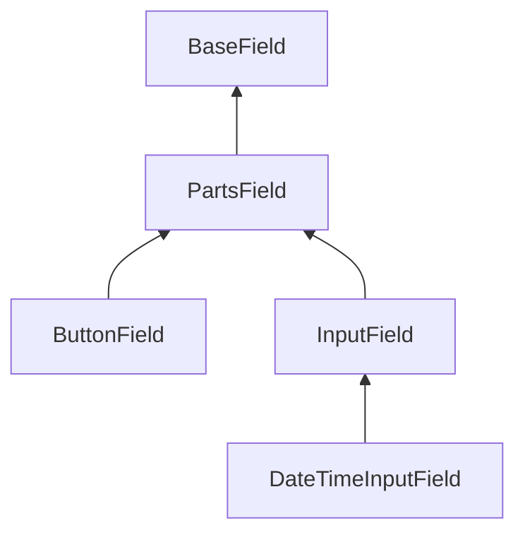

# Criando e usando campos personalizados

Você pode criar seus próprios campos com base nos campos abstratos incluídos no pacote.

## Criando classe de campo

A classe "Field" deve estender de `Yiisoft\Form\Field\Base\BaseField` ou um de seus filhos e implementar os métodos abstratos necessários.

### Classes básicas

- `BaseField` — classe base que contém funcionalidades comuns dos campos.
- `PartsField` — classe que estende `BaseField`. Ele adiciona funcionalidade de modelo e partes de campo (label, hints, error).
- `InputField` — classe estende `PartsField`. Adiciona suporte ao modelo de formulário (na maioria dos casos, esta classe é usada como base).
- `ButtonField` — classe específica para campos de botão, estende `PartsField`.
- `DateTimeInputField` — classe específica para criação de controles de formulário com entrada de data e/ou hora, estende `InputField`.

Estrutura de classes abstratas básicas:



### Traits

Você pode usar traits para sua classe de campo.

#### `FormAttributeTrait`

Adiciona métodos para usar o modelo de formulário.

#### `FieldContentTrait`

Adiciona métodos para definir e gerar conteúdo de campo personalizado.

#### `VaidationClassTrait`

Adiciona métodos para definir classes CSS válidas e inválidas.

Para aplicar a configuração de campo comum quando o campo é criado por meio de uma fábrica de campos, a classe deve implementar
`ValidaçãoClassInterface`.

#### `PlaceholderTrait`

Adiciona métodos para usar placeholder. Pode ser aplicado apenas aos filhos de `InputField`.

Para aplicar a configuração de campo comum quando o campo é criado por meio do factory, a classe deve implementar
`PlaceholderInterface`.

#### `EnrichFromValidationRulesTrait`

Adiciona método para definir opção de campo de enriquecimento das regras do modelo de formulário.

Para aplicar a configuração de campo comum quando o campo é criado por meio do factory deve implementar
`EnrichFromValidationRulesInterface`.

## Configuração de campo

Define a configuração base do campo através do parâmetro "fieldConfigs" do factory. Por exemplo:

```php
'fieldConfigs' => [
    MyCustomField::class => [
        'containerTag()' => ['div'],
        'containerAttributes()' => [['class' => 'main-wrapper']],
        'inputAttributes()' => [['data-type' => 'input-text']],
        'customMethod()' => [true],
    ],
],
```

Informações detalhadas sobre configuração de campos veja [Configuração de campos](fields-configuration.md).

## Exemplo de campo personalizado


Classe "Field":

```php
use Yiisoft\Form\Field\Base\InputField;
use Yiisoft\Html\Html;

final class SuffixInput extends InputField
{
    private ?string $suffix = null;

    public function suffix(?string $suffix): self
    {
        $new = clone $this;
        $new->suffix = $suffix;
        return $new;
    }

    protected function generateInput(): string
    {
        $input = Html::textInput(
            $this->getInputName(),
            (string) $this->getFormAttributeValue(),
            $this->getInputAttributes()
        )->render();

        if ($this->suffix === null) {
            $html = $input;
        } else {
            $html = '<div class="input-group">' . "\n";
            $html .= $input . "\n";
            $html .= '<span class="input-group-text">' . Html::encode($this->suffix) . '</span>' . "\n";
            $html .= '</div>';
        }

        return $html;
    }
}
```

O uso é o seguinte:

```php
echo \Yiisoft\Form\YiisoftFormModel\Field::input(SuffixInput::class, $procentForm, 'value')->suffix('%');
```

O resultado será:

```html
<div>
    <label for="procentform-value">Value</label>
    <div class="input-group">
        <input type="text" id="procentform-value" name="ProcentForm[value]" value>
        <span class="input-group-text">%</span>
    </div>
</div>
```
